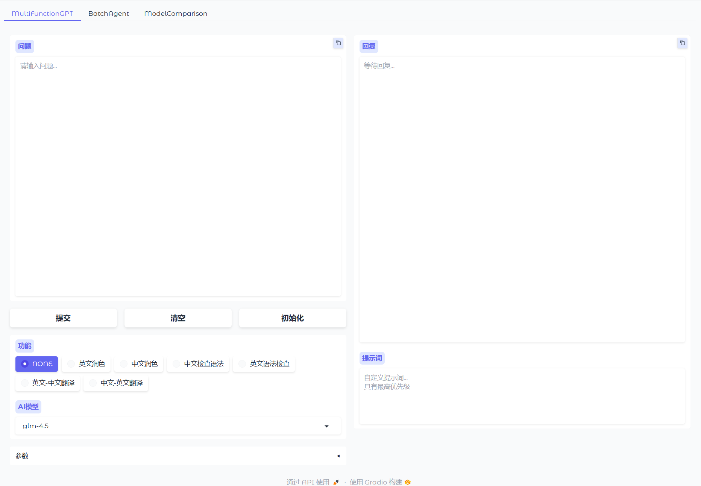
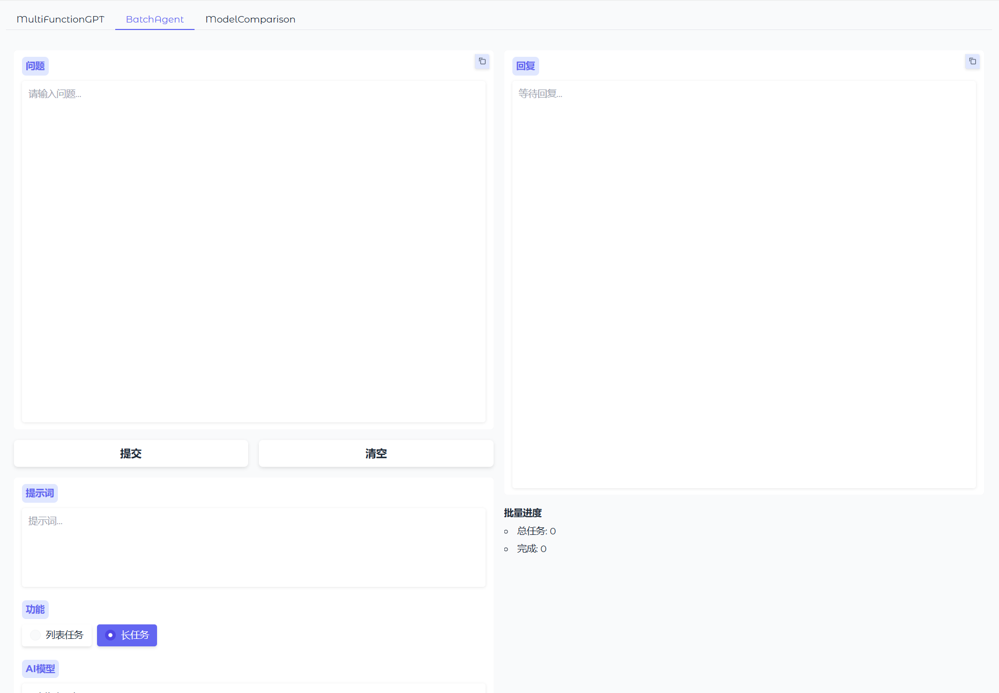

# PrivateGPT

一个轻量、清晰且易扩展的私人 Chat 助手，支持主流 OpenAI 兼容 API 与本地模型。工程提供统一的参数设置、批量处理与多模型并行对比能力。

## 使用方法

### MultiFunctionGPT（单次对话）

- 选择 `AI模型`。
- 在 `功能` 中选择预设提示词，或填写右侧 `提示词`（自定义优先级更高）。
- 展开 `参数`，设置 `top_p` 与 `temperature`（可使用默认值）。

适用场景：快速问答、基于功能模板的标准化输出。输出以流式方式逐步显示。



### BatchAgent（批量处理）

- 功能选择：
    - `列表任务`：每行一个小任务，适合待办集合、条目式处理；
    - `长任务`：粘贴长文本，系统将智能切分为多段并行处理。
- 可填写 `提示词`（自定义），用于指导批量任务的输出风格与结构。
- 选择 `AI模型` 并设置 `参数`。

适用场景：论文段落改写、任务清单批处理、长文本拆分与并发生成。



### ModelComparison（多模型并行对比）

- 在顶部填写 `问题` 与 `提示词`。
- 分别选择三个模型（`模型1/2/3`），可为每个模型设置独立的 `top_p` 与 `temperature`。
- 点击 `全部提交` 开始三路并行生成；或在各模型区域点击 `提交` 进行单独比较。

适用场景：横向比较不同模型的生成质量、风格与速度，辅助选择最适合当前任务的模型与参数。


## 安装与运行

- 安装依赖：

```shell
pip install -r requirements.txt
```

- 启动应用：

```shell
python index.py
```

或执行 Windows 批处理脚本：

```shell
run.bat
```

## 配置说明

- 在 `config/model_config.py` 中配置供应商与模型映射：`supplier_dict`（API 密钥与 Base URL）与 `model_dict`（模型的供应商、最大
  tokens、并发上限）。

```python
supplier_dict = {
    "zhipuai": {"api": "<YOUR_API_KEY>", "url": "https://open.bigmodel.cn/api/paas/v4"},
    "aliai": {"api": "<YOUR_API_KEY>", "url": "https://dashscope.aliyuncs.com/compatible-mode/v1"},
    "kimiai": {"api": "<YOUR_API_KEY>", "url": "https://api.moonshot.cn/v1"},
    "deepseek": {"api": "<YOUR_API_KEY>", "url": "https://api.deepseek.com/v1"},
}

model_dict = {
    "glm-4.5": {"supplier": "zhipuai", "max_tokens": 8192, "max_concurrent": 10},
    "kimi-k2-0711-preview": {"supplier": "kimiai", "max_tokens": 8192, "max_concurrent": 10},
    "deepseek-chat": {"supplier": "deepseek", "max_tokens": 4096, "max_concurrent": 10},
}

```

- 在 `config/function_config.py` 中维护功能提示词模板：`function_dict` 将功能名称映射到系统提示词文本（中英混合视具体需求）。

```python

function_dict: dict[str, str] = {
    "NONE":
        "",
    "<function_name>":
        """<prompt>""",
    "<function_name>":
        """<prompt>""",

}

```
