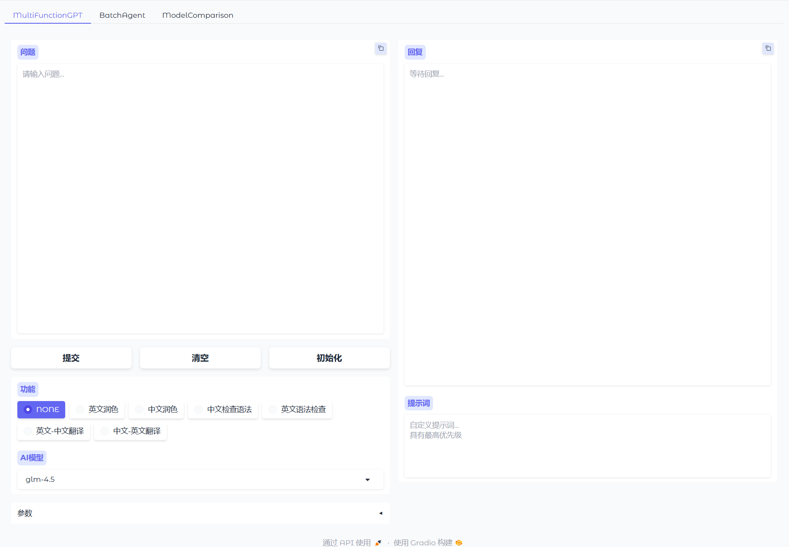
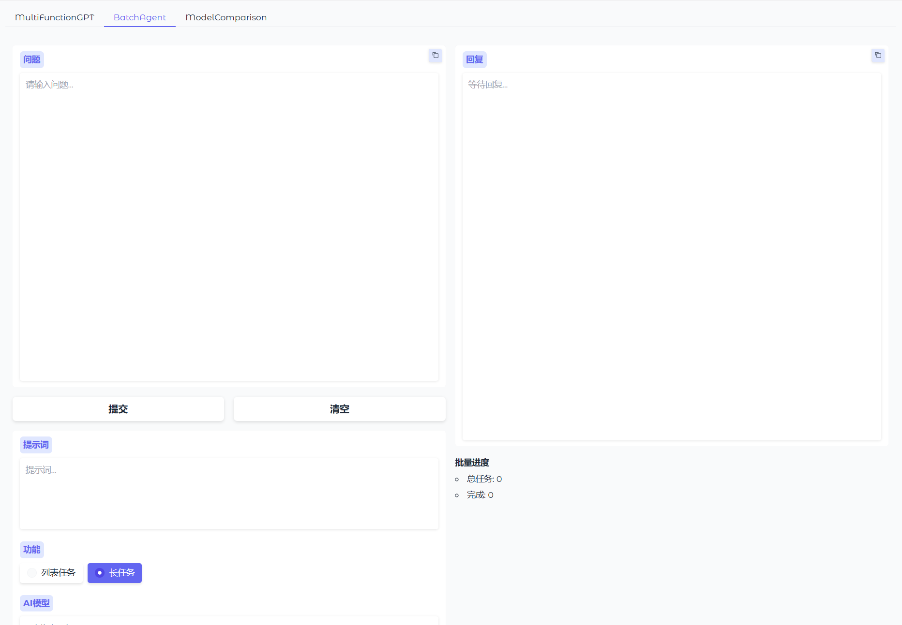
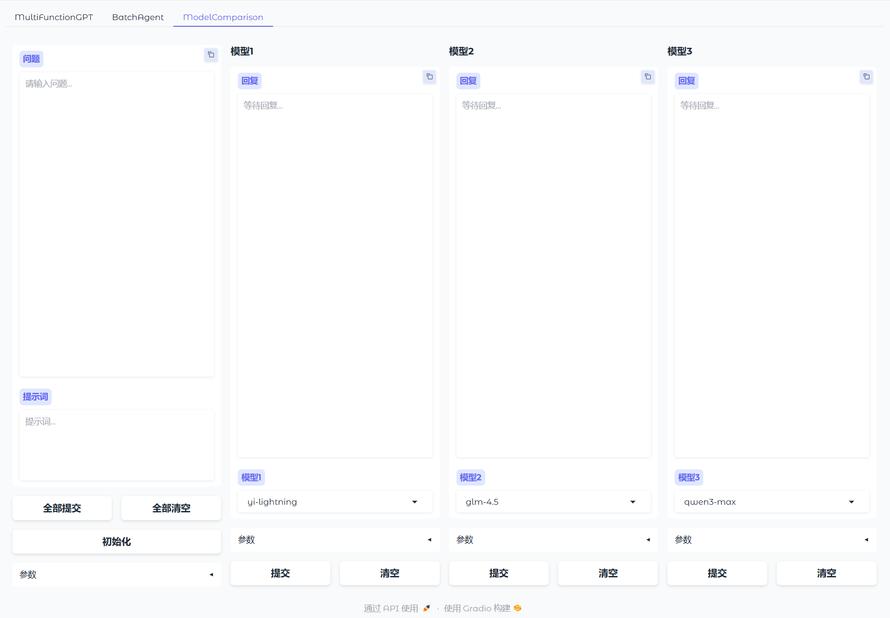

# PrivateGPT

A lightweight, clean, and extensible private chat assistant that supports mainstream OpenAI-compatible APIs and local models. The project provides unified parameter settings, batch processing, and multi-model parallel comparison capabilities.

## Usage

### MultiFunctionGPT 

- Select an `AI Model`.
- Choose a preset prompt in `Function` or enter a custom prompt in the right-side `Prompt` field (custom prompts have higher priority).
- Expand `Parameters` to set `top_p` and `temperature` (default values can be used).

**Use Cases**: Quick Q&A, standardized output based on function templates. Output is displayed in a streaming fashion.



### BatchAgent 

- Function selection:
  - `List Task`: One task per line, suitable for to-do lists and item-based processing
  - `Long Task`: Paste long text, the system will intelligently split it into segments for parallel processing
- Enter a custom `Prompt` to guide output style and structure for batch tasks
- Select an `AI Model` and set `Parameters`

**Use Cases**: Thesis paragraph rewriting, batch processing of task lists, long text splitting and concurrent generation.



### ModelComparison 

- Enter a `Question` and `Prompt` at the top
- Select three models (`Model1/2/3`), each can have independent `top_p` and `temperature` settings
- Click `Submit All` for three-way parallel generation, or use individual `Submit` buttons for model comparisons

**Use Cases**: Compare generation quality, style, and speed across different models to help select the optimal model and parameters for current tasks.



## Installation & Running

- Install dependencies:

```shell
pip install -r requirements.txt
```

- Launch application:

```shell
python index.py
```

Or run the Windows batch script:

```shell
run.bat
```

## Configuration Guide

- Configure vendor and model mappings in `config/model_config.py`: `supplier_dict` (API keys and Base URLs) and `model_dict` (model vendor, max tokens, max concurrency)

```python
supplier_dict = {
    "zhipuai": {"api": "<YOUR_API_KEY>", "url": "https://open.bigmodel.cn/api/paas/v4"},
    "aliai": {"api": "<YOUR_API_KEY>", "url": "https://dashscope.aliyuncs.com/compatible-mode/v1"},
    "kimiai": {"api": "<YOUR_API_KEY>", "url": "https://api.moonshot.cn/v1"},
    "deepseek": {"api": "<YOUR_API_KEY>", "url": "https://api.deepseek.com/v1"},
}

model_dict = {
    "glm-4.5": {"supplier": "zhipuai", "max_tokens": 8192, "max_concurrent": 10},
    "kimi-k2-0711-preview": {"supplier": "kimiai", "max_tokens": 8192, "max_concurrent": 10},
    "deepseek-chat": {"supplier": "deepseek", "max_tokens": 4096, "max_concurrent": 10},
}
```

- Maintain function prompt templates in `config/function_config.py`: `function_dict` maps function names to system prompt texts (mixed Chinese/English as needed)

```python
function_dict: dict[str, str] = {
    "NONE":
        "",
    "<function_name>":
        """<prompt>""",
    "<function_name>":
        """<prompt>""",
}
```